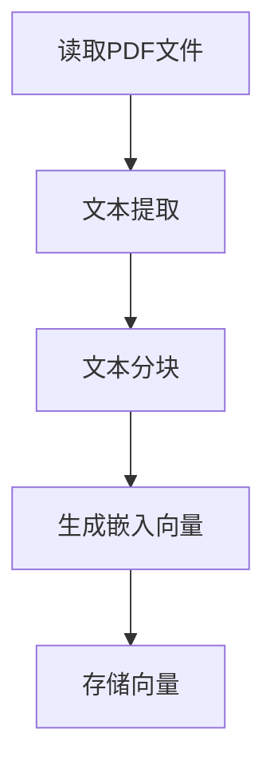
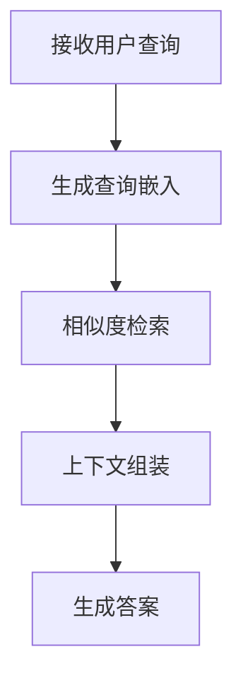

# RAG-LLM 财报分析系统

基于国外财报PDF数据构建的检索增强生成(RAG)系统

## 安装说明

1. 先创建虚拟环境

2. 安装依赖
```bash
pip install -r requirements.txt
```

3. 配置环境变量
在项目根目录创建`.env`文件，添加您的OpenAI API密钥：
```
OPENAI_API_KEY=your_api_key_here
```

## 使用方法

### 1. 处理财报文件并创建嵌入向量

首先需要处理财报文件并将其向量化，这些向量将存储在本地以供后续使用：

```bash
python run.py --mode train --folder_path financial_reports --embedding_file data/document_embeddings.pkl
```

参数说明：
- `--mode train`: 指定运行模式为训练（处理文档并生成嵌入）
- `--folder_path`: 指定财报PDF文件的目录路径
- `--embedding_file`: 指定向量数据存储的文件路径

此命令会：
1. 遍历指定目录下的所有PDF文件
2. 使用OpenAI API将文档内容转换为嵌入向量
3. 将嵌入向量存储到指定文件
4. 跳过已处理过的文件，仅处理新文件

### 2. 交互式问答模式

基于已向量化的数据进行交互式问答：

```bash
python run.py --mode interactive --embedding_file data/document_embeddings.pkl
```

### 3. 启动API服务

启动REST API服务，支持通过HTTP API查询系统：

```bash
python run.py --mode api --port 8000 --embedding_file data/document_embeddings.pkl
```

### 4. Web界面

启动基于Streamlit的Web界面：

```bash
streamlit run app.py
streamlit run app.py --server.enableWatchdogWarning=false
```

启动基于Gradio的Web界面：

```
python app1,py
```

Web界面支持：

- 直接处理财报文件并生成嵌入向量
- 使用不同的检索策略查询信息
- 显示文档统计和来源分布
- 查看检索到的文档上下文和来源

## 主要功能

1. 基本对话能力
2. 财报文档检索与问答
3. 多种检索策略（事实检索、分析检索、观点检索、上下文检索）
4. 财务数据识别与标记
5. 表格提取与检索（新增）
6. 利用OpenAI嵌入模型将财报内容转换为高质量向量
7. 采用多种检索策略，针对不同类型的问题优化检索过程
8. 支持对财报内容进行语义搜索和问答
9. 可以分析多家公司的财报数据，跨文档检索信息
10. 支持问题增强生成，改善检索质量
11. 向量化数据存储于本地，无需重复处理

### 表格提取功能

新增表格提取功能，可以从财报PDF中自动提取表格数据，并支持表格检索和问答。

#### 技术实现

- 使用Docling和本地Llama模型提取表格
- 支持表格识别、结构化和搜索
- 在问答时，如果查询涉及表格数据，会自动提取相关表格并展示

#### 使用方法

1. 在"表格提取"标签页中点击"提取财报表格"按钮
2. 等待系统自动处理所有财报中的表格
3. 使用表格搜索功能，输入关键词查找相关表格
4. 在对话问答时，如果问题涉及表格数据，系统会自动检索相关表格并一同回答

## Pipeline流程

#### 2.1 文档处理阶段



1. 文档加载

   - 从financial_reports目录读取PDF文件

   - 使用PyPDF2提取文本内容

2. 文本预处理

   - 使用RecursiveCharacterTextSplitter进行文本分块
   - 默认块大小：1000字符
   - 重叠大小：200字符

3. 嵌入向量生成

   支持两种模式：

   - 本地模型：sentence-transformers/all-MiniLM-L6-v2
   - OpenAI API：text-embedding-3-small
   - 包含重试机制和速率限制

4. 向量存储
   - 将嵌入向量保存到data/document_embeddings.pkl
   - 支持增量更新

#### 2.2 查询处理阶段



1. 查询处理
   - 接收用户输入的问题
   - 生成查询文本的嵌入向量

2. 文档检索
   - 使用FAISS进行相似度检索
   - 返回最相关的文档块

3. 答案生成

   支持两种模式：

   - 本地模型：facebook/opt-125m
   - OpenAI API：gpt-3.5-turbo

   使用检索到的上下文生成答案

## 工作原理

### 文档处理阶段：

- 系统读取`financial_reports`目录中的所有PDF文件
- 将PDF内容分割成小块以适应模型处理
- 使用OpenAI API生成文档块的嵌入向量
- 生成问题增强数据以提高检索质量
- 将所有向量存储到本地PKL文件中

### 检索和问答阶段：

- 系统从本地加载预计算的嵌入向量
- 根据用户查询和选择的策略检索相关文档
- 将检索到的文档与用户问题结合生成答案
- 返回答案并显示相关上下文和来源

### 表格检测与提取

我们添加了多种机制来识别和处理表格数据：

- 在PDF处理阶段：
  - 使用正则表达式模式识别表格行和结构
  - 识别表格的开始和结束
  - 处理表格跨页情况
  - 将表格单独存储，并添加特殊标记 [TABLE] 和 [/TABLE]

- 在检索阶段：
  - 对包含表格的文档增加权重
  - 如果查询与表格内容相关，显著提高表格文档的优先级
  - 如果检索结果中不包含表格但查询是关于财务数据，尝试找出最相关的表格文档

- 在处理阶段：
  - 检测上下文中的表格格式
  - 尝试将文本格式的表格转换为DataFrame
  - 为LLM提供特殊指令，优先使用表格数据

### 表格显示

- 添加了专门的DataFrame组件显示提取的表格

- 当检索结果中包含表格数据时，系统会自动解析并显示表格

- 表格数据会在界面上单独展示，使用户可以清晰查看

###  改进模型提示

- 指示模型优先使用表格数据回答问题

- 改进了对表格数据的识别和标记

- 降低了模型温度，使回答更加精确

这些改进应该能够很好地解决你的问题，当查询涉及到财报中的数据（如 Airstar Bank 2022年的总收入）时，系统会：

1. 优先检索包含相关表格的文档
2. 尝试将文本表格转换为结构化表格
3. 在用户界面上显示这些表格
4. 引导模型从表格中提取准确的数字回答问题

当你再次提问"Airstar Bank 2022年的总收入是多少"时，系统不仅会提供回答，还会展示相关的财务表格（如果存在于文档中）

## 项目结构

```
RAG-LLM/
├── app1.py                 # Gradio Web界面
├── run.py                  # 命令行运行入口
├── requirements.txt        # 依赖库
├── .env                    # 环境变量(包含API密钥)
├── src/                    # 源代码
│   ├── config.py           # 配置文件
│   ├── embeddings.py       # 嵌入处理
│   ├── main.py             # 主程序
│   ├── retrieval.py        # 检索策略
│   └── utils.py            # 工具函数
├── data/                   # 数据目录
│   └── document_embeddings.pkl  # 保存的嵌入向量
└── financial_reports/      # 财报PDF文件
    ├── company1_downloads/
    ├── company2_downloads/
    └── ...
```

## 检索策略

系统支持以下检索策略：

- **事实检索(Factual)**: 适用于查询具体事实和数据
- **分析检索(Analytical)**: 适用于需要跨文档分析的查询
- **观点检索(Opinion)**: 适用于寻找不同视角的查询
- **上下文检索(Contextual)**: 根据用户上下文优化检索结果

## 注意事项

- 首次运行需要处理PDF文件并生成嵌入向量，这可能需要一些时间和API调用
- 一旦生成嵌入向量并存储到本地，后续运行可以直接加载本地数据
- 系统使用OpenAI的嵌入API，请确保API密钥有足够的配额
- 可以定期运行训练模式以处理新添加的财报文件

